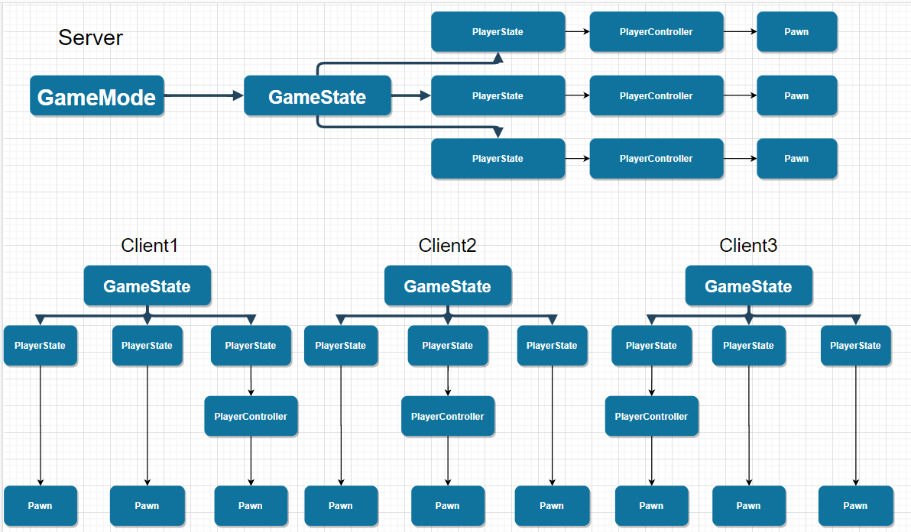
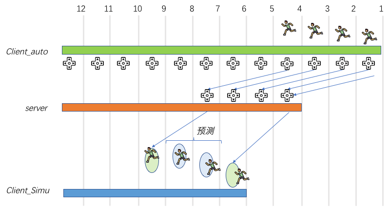
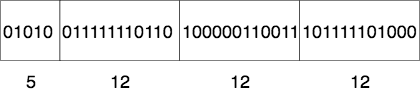
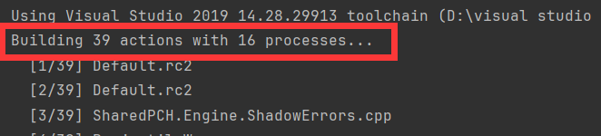
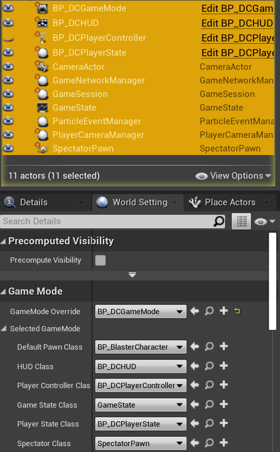
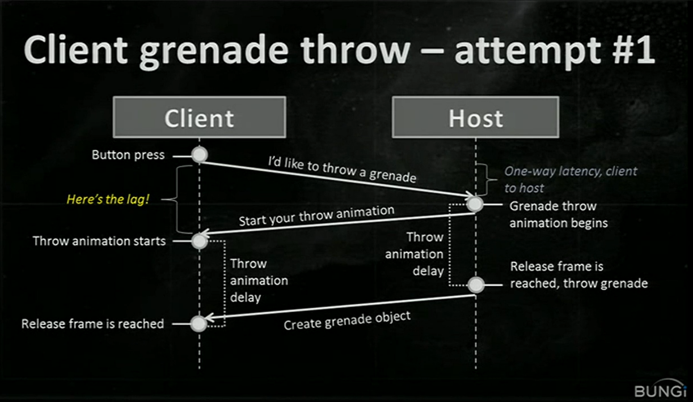
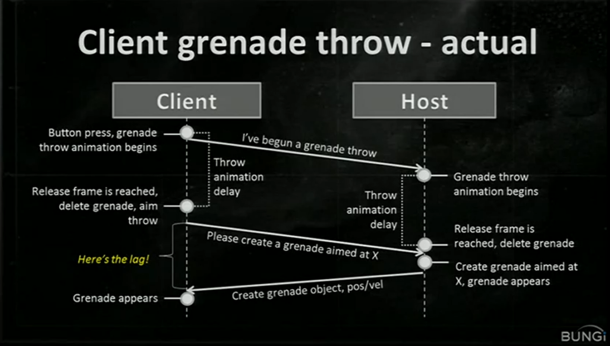

* content
{:toc #markdown-toc}

这是随手记得，很杂，在做的过程中一直改，还未整理，仅供参考

<!-- more -->

# 网络概述



遇到问题：UE版本5.2.1，character movement组件的Character Movement(Networking)中Network Smoothing Mode为Linear或Exponential时调用蓝图函数Set Capsule Half Height 会使得Mesh相对于根节点的位置重置

https://docs.unrealengine.com/4.27/zh-CN/InteractiveExperiences/Networking/Overview/

相关性和优先级

**相关性** 用于决定是否需要在多人游戏期间复制Actor。复制期间将剔除被认为不相关的actor。此操作可节约带宽，以便相关Actor可更加高效地复制。若Actor未被玩家拥有，且不在玩家附近，将其被视为不相关，而不会进行复制。不相关Actor会存在于服务器上，且会影响授权游戏状态，但在玩家靠近前不会向客户端发送信息。覆盖 IsNetRelevantFor 函数以手动控制相关性，并可使用 NetCullDistanceSquared 属性决定成为相关Actor所需距离。

有时在游戏单帧内，没有足够带宽供复制所有相关Actor。因此，Actor拥有 **优先级（Priority）** 值，用于决定优先复制的Actor。Pawn和PlayerController的 NetPriority 默认为 **3.0**，从而使其成为游戏中最高优先级的Actor，而基础Actor的 NetPriority 为 **1.0**。Actor在被复制前经历的时间越久，每次成功通过时所处的优先级便越高。

在游戏中实现高效、稳定多人游戏系统的基本指南如下。

基本复制Actor清单

按照以下步骤，可创建复制Actor：

- 将Actor的复制设置设为True。
- 若复制Actor需要移动，将复制移动（Replicates Movement）设为True。
- 生成或销毁复制Actor时，确保在服务器上执行该操作。
- 设置必须在机器间共享的变量，以便进行复制。这通常适用于以gameplay为基础的变量。
- 尽量使用虚幻引擎的预制移动组件，其已针对复制进行构建。
- 若使用服务器授权模型，需确保玩家可执行的新操作均由服务器函数触发。

网络提示

- 尽可能少用RPC或复制蓝图函数。在合适情况下改用RepNotify。
- 组播函数会导致会话中各连接客户端的额外网络流量，需尤其少用。
- 若能保证非复制函数仅在服务器上执行，则服务器RPC中无需包含纯服务器逻辑。
- 将可靠RPC绑定到玩家输入时需谨慎。玩家可能会快速反复点击按钮，导致可靠RPC队列溢出。应采取措施限制玩家激活此项的频率。
- 若游戏频繁调用RPC或复制函数，如tick时，则应将其设为不可靠。
- 部分函数可重复使用。调用其响应游戏逻辑，然后调用其响应RepNotify，确保客户端和服务器拥有并列执行即可。
- 检查Actor的网络角色可查看其是否为 ROLE_Authority。此方法适用于过滤函数中的执行，该函数同时在服务器和客户端上激活。
- 使用C++中的 IsLocallyControlled 函数或蓝图中的Is     Locally Controlled函数，可检查Pawn是否受本地控制。基于执行是否与拥有客户端相关来过滤函数时，此方法十分拥有。
- 构造期间Pawn可能未被指定控制器，因此避免在构造函数脚本中使用 IsLocallyControlled。

# RPC

参考：[虚幻引擎文档](https://docs.unrealengine.com/5.2/en-US/rpcs-in-unreal-engine/)

**从服务器调用的 RPC**

| Actor 所有权       | 未复制         | NetMulticast               | Server         | Client                      |
| ------------------ | -------------- | -------------------------- | -------------- | --------------------------- |
| Client-owned actor | 在服务器上运行 | 在服务器和所有客户端上运行 | 在服务器上运行 | 在 actor 的所属客户端上运行 |
| Server-owned actor | 在服务器上运行 | 在服务器和所有客户端上运行 | 在服务器上运行 | 在服务器上运行              |
| Unowned actor      | 在服务器上运行 | 在服务器和所有客户端上运行 | 在服务器上运行 | 在服务器上运行              |

**从客户端调用的 RPC**

| Actor 所有权                | 未复制                   | NetMulticast             | Server         | Client                   |
| --------------------------- | ------------------------ | ------------------------ | -------------- | ------------------------ |
| Owned by invoking client    | 在执行调用的客户端上运行 | 在执行调用的客户端上运行 | 在服务器上运行 | 在执行调用的客户端上运行 |
| Owned by a different client | 在执行调用的客户端上运行 | 在执行调用的客户端上运行 | 丢弃           | 在执行调用的客户端上运行 |
| Server-owned actor          | 在执行调用的客户端上运行 | 在执行调用的客户端上运行 | 丢弃           | 在执行调用的客户端上运行 |
| Unowned actor               | 在执行调用的客户端上运行 | 在执行调用的客户端上运行 | 丢弃           | 在执行调用的客户端上运行 |

**但是我们在编写多人游戏的时候,我们需要确保添加 RPC 不仅仅是为了进行复制一些属性、Actor等。我们需要考虑可能有更有效的办法。利用已经有的RPC或ReplicatedNotify等是一个很好的办法。**比如：子弹在服务器射中目标播放声音和特效，需要添加一个Multicast方法吗？不必要，由于射中物体子弹销毁，而所调用的Destroy方法广播给所有绑定的物体进行销毁，而我们的子弹是`bReplicates = true;`那么确实会传播给所有客户端，因此我们可以利用Destroy进行多播。

```c++
void AActor::Destroyed()
{
	RouteEndPlay(EEndPlayReason::Destroyed);

	ReceiveDestroyed();
	OnDestroyed.Broadcast(this);
}
```
```c++
void AProjectile::Destroyed()
{
	Super::Destroyed();

	if (ImpactParticle)
	{
		UGameplayStatics::SpawnEmitterAtLocation(GetWorld(), ImpactParticle, GetActorTransform());
	}
	if (ImpactSound)
	{
		UGameplayStatics::PlaySoundAtLocation(this, ImpactSound, GetActorLocation());
	}
}

void AProjectile::OnHit(UPrimitiveComponent* HitComp, AActor* OtherActor, UPrimitiveComponent* OtherComp,
                        FVector NormalImpulse, const FHitResult& HitResult)
{
	Destroy();
}
```


插件：插件由一个或多个模块组成，每个模块都有自己的C++代码和.Build.cs构建文件游戏模块，模块只有代码不能包含uassets文件如mesh、纹理等，封装使其井井有条；我们游戏项目本身就是一个模块，当我们启用插件时，会添加到我们的.uproject文件，一个插件可以引用其他插件，UE支持相互依赖的模块和插件，但是需要注意：插件和模块都有层次结构，只能依赖于其他相同或更高层级的插件和模块，如：我们游戏模块可以依赖引擎模块，引擎模块不能依赖我们的游戏，引擎的许多模块可以引用是因为处在同一层级。

PublicDependencyModuleNames和PrivateDependencyModelNames唯一区别是：将他们添加到私有依赖模块名称意味着这些模块仅在私有源文件中可用，如果想在项目中使用这些模块就需要添加到PublicDependencyModuleNames中

在.uproject和.uplugin文件中可以更改此模块的属性和启用的插件


# FLatentActionInfo

参考：[How does the FLatentActionInfo Linkage variable work?](https://forums.unrealengine.com/t/how-does-the-flatentactioninfo-linkage-variable-work/440636)

```c++
// Trigger any pending execution links
	for (FLatentResponse::FExecutionInfo& LinkInfo : Response.LinksToExecute)
	{
        // INDEX_NONE == -1; LinkID : LatentActionInfo.Linkage
		if (LinkInfo.LinkID != INDEX_NONE)
		{
			if (UObject* CallbackTarget = LinkInfo.CallbackTarget.Get())
			{
				check(CallbackTarget == InObject);

				if (UFunction* ExecutionFunction = CallbackTarget->FindFunction(LinkInfo.ExecutionFunction))
				{
					CallbackTarget->ProcessEvent(ExecutionFunction, &(LinkInfo.LinkID));
				}
			}
		}
	}
```


UE中虽然可以前置声明，但是枚举类的前置声明较为特殊格式类似于：

```c++
enum class ETurningInPlace : uint8;
```

那么此时编译会报错：

```ABAP
Unrecognized type 'ETurningInPlace' - type must be a UCLASS, USTRUCT or UENUM
```

因此，如果不想在头文件引用体积大u的头文件，一般会另建头文件去写此枚举类，然后再引用枚举类的头文件

# UE4移动的网络同步

参考：[UE4移动的网络同步](https://zhuanlan.zhihu.com/p/114341957)
[《Exploring in UE4》移动组件详解[原理分析]](https://zhuanlan.zhihu.com/p/34257208)


## **Simulate客户端预测**

Simulate客户端收到的移动数据，相比移动刚发生时，理论上位置已经延迟了一个RTT，收到即落后。如果在此基础上进行平滑移动，平滑目标为服务器同步最新位置，那么又落后了一个平滑周期的时间。因此为了使Simulate客户端上角色更接近游戏实时状态，UE4允许Simulate角色进行本地预测移动。在每帧TickComponent时，对Simulate客户端会执行SimulateMovement，获取当前速度，大部分情况当前速度就是移动同步下来的玩家速度，然后把加速度设为和速度方向一样，大小为1，因此rotation并不会改变。移动会忽略MovementMode，且忽略摩擦力等外力对速度的影响。直到下一次收到服务器位置更新，再进行新的预测移动。

预测和插值会同时进行，预测改变的是世界transform，插值改变的是相对transform，不冲突。

加入预测后，Simulate客户端上角色移动落后就只有一个RTT了。



**一个实现细节：关于FVector_NetQuantize**

移动同步涉及到很多实现细节，没法面面俱到的介绍，在此仅把FVector_NetQuantize作为其中一个示例进行细致分析。

移动同步中的位置、加速度、速度都可以用FVector表示，内含3个float类型变量，总共12个Byte。相对于游戏中大部分使用场景，float的表示范围是大大溢出的，但是float遵循IEEE754标准，在网络上传输float无法使用自适应Bit流来减小数据量，导致直接传输FVector就必须用12个Byte，有些浪费。

FVector_NetQuantize数据结构就是为了解决这个问题，它使用了有损压缩技术。在进行网络序列化时，会把向量中的float转换成int传输，减小数据量，反序列化时，再把int恢复成float，再组合成FVector，会损失一些精度，但大部分情况都可接受。

FVector_NetQuantize数据结构有多个版本，我们常用的有FVector_NetQuantize10和FVector_NetQuantize100，后面的数字代表float转换成int时，精确到小数点的位数，显然后者更高。它们表示范围有限制，比如FVector_NetQuantize10中数字表示范围是2^24/10，即+/-1677721.6，至于为什么会在接下来介绍，使用时留意此范围即可。如果FVector代表角色位置，长度单位是厘米，那么精确到1/100厘米对游戏而言是完全OK的。

**序列化**

FVector_NetQuantize序列化会使用SerializePackedVector函数

```c++
template<uint32 ScaleFactor, int32 MaxBitsPerComponent>
bool SerializePackedVector(FVector &Vector, FArchive& Ar)
{
	if (Ar.IsSaving())
	{
		return  WritePackedVector<ScaleFactor, MaxBitsPerComponent>(Vector, Ar);
	}

	ReadPackedVector<ScaleFactor, MaxBitsPerComponent>(Vector, Ar);
	return true;
}
```

函数接受两个模版参数，第一个是缩放大小，即10、100，第二个是转换成int后可使用的最大bit数，限制了表示范围。FVector_NetQuantize10在序列化时，两个参数分别为10和24，因此表示范围是2^24/10。

序列化步骤如下

1. FVector乘以ScaleFactor，进行放大
2. 把float转换成int
3. 计算表示三个int绝对值+1（正数）所需最大位数，记为Bits，在MaxBitsPerComponent处截断
4. 计算偏移Bias=1<<(Bits+1)，然后把三个int都加上Bias，这是为了把负数都变成正数传输，这样才能用自适应Bit流
5. 计算上限Max=1<<(Bits+2)，并用Max-1对int数值进行截断
6. 先向数据流写入Bits，表示后续数字的最大位数，再依次写入三个int值，每个int值要求所用bit位数相同，不满的用0填充，完成序列化


例子：使用FVector_NetQuantize10传输(-1.0, 5.1, 100.0)

首先，把它们乘以ScaleFactor，得到(-10, 51, 1000)

然后计算表示它们需要的最大位数，为10，2^10=1024，因此Bias = 2048

之后三个int都加上Bias，得到(2038, 2099, 3048)

依次向数据流写入10和(2038, 2099, 3048)，此时数据流为：



总共使用了41位，原始的三个float需要128位，仅为其32%大小。留意10和2038的第一位0填充。


**反序列化**

了解了序列化过程，反序列化也不难理解了。

首先知道这是FVector_NetQuantize10类型数据，因此10和24这两个数字是确定的。于是可以从Bit流头部取出5位，得到“Bits“，从而得到上限“Max”和”Bias“，以及之后每个数字所用位数。剩下就是依次获取三个int值，然后减去Bias，并除以ScaleFactor进行还原。

实际案例：ServerMove接口

```c++
void UCharacterMovementComponent::ServerMove_Implementation(
	float TimeStamp,
	FVector_NetQuantize10 InAccel,
	FVector_NetQuantize100 ClientLoc,
```

加速度InAccel使用FVector_NetQuantize10存储，位置ClientLoc使用FVector_NetQuantize100存储。

## Simulate Proxy的旋转

在做AimOffset的时候发现，骨骼的旋转在Simulate Proxy上有点抖，这是因为AimOffset在动画蓝图里旋转了骨骼，而动画蓝图在本地机子和服务器上是每帧调用的这样看起来没有问题，但是实际上Simulate Proxy并不是每帧更新的，并且它的更新还有网络更新的影响，这样就慢的多，因此Simulate Proxy会抖来抖去。

# HUD 和 PlayerController

APlayerController::GetHUD()
AHUD::DrawHUD()
AHUD::DrawTexture()

# PlayerState

playerstate的网络更新较慢，Health变量放在这里不合适，放在Character里做成员变量即可

# Rider使用

## UE 编译时 PCH 虚拟内存不足的错误

在多核 CPU 上编译 UE 时，可能比较频繁的遇到以下错误，尤其是编译的数量较多的时候：

```ABAP
0>c1xx: Error C3859 : 未能创建 PCH 的虚拟内存
	c1xx: note: 系统返回代码 1455: 页面文件太小，无法完成操作。
	c1xx: note: 请访问 https://aka.ms/pch-help 了解更多详情
0>c1xx: Error C1076 : 编译器限制: 达到内部堆限制
  Microsoft.MakeFile.targets(51, 5): [MSB3073] 命令“D:\UE_4.26\Engine\Build\BatchFiles\Rebuild.bat MyProjectEditor Win64 Development -Project="D:\UEProject\MultiGame\Multi_Test\MyProject.uproject" -WaitMutex -FromMsBuild”已退出，代码为 -1。
```

默认情况下，UE 会拉起系统最大线程数量的编译进程。就比如我电脑是16个



UE 里每个编译任务的 `/zm` 值为 1000：[VCToolChain.cs?q=%2Fzm#L354](https://cs.github.com/EpicGames/UnrealEngine/blob/d11782b9046e9d0b130309591e4efc57f4b8b037/Engine/Source/Programs/UnrealBuildTool/Platform/Windows/VCToolChain.cs?q=/zm#L354)
表示每个 cl 进程会分配 750M 的虚拟内存：[/Zm (Specify precompiled header memory allocation limit)](https://docs.microsoft.com/en-us/cpp/build/reference/zm-specify-precompiled-header-memory-allocation-limit?view=msvc-160)

| Value of *`factor`* | Memory allocation limit |
| :------------------ | :---------------------- |
| 10                  | 7.5 MB                  |
| 100                 | 75 MB                   |
| 200                 | 150 MB                  |
| 1000                | 750 MB                  |
| 2000                | 1500 MB                 |

如果ue使用的虚拟内存大于系统的虚拟内存，就会导致分配失败
TaskCount ∗ PCHMemoryAllocationFactor > SystemVirtualMemery
那么就有两种办法可以解决：一个是减少`TaskCount`，另一个就是减少`PCHMemoryAllocationFactor`。这两种办法都可以通过编辑`BuildConfiguration.xml`进行更改

1. 减少TaskCount：[本地执行器和并行执行器](https://docs.unrealengine.com/4.27/en-US/ProductionPipelines/BuildTools/UnrealBuildTool/BuildConfiguration/#localexecutor)

   ```xml
   <LocalExecutor>
   	<MaxProcessorCount>8</MaxProcessorCount>
   </LocalExecutor>
   <ParallelExecutor>
   	<MaxProcessorCount>8</MaxProcessorCount>
   </ParallelExecutor>
   ```

2. 减少PCHMemoryAllocationFactor：[WindowsPlatform->PCHMemoryAllocationFactor](https://docs.unrealengine.com/4.27/en-US/ProductionPipelines/BuildTools/UnrealBuildTool/BuildConfiguration/#windowsplatform)

   ```xml
   <WindowsPlatform>
   	<PCHMemoryAllocationFactor>200</PCHMemoryAllocationFactor>
   </WindowsPlatform>
   ```

### BuildConfiguration.xml

除添加到 `Config/UnrealBuildTool` 文件夹中已生成UE4项目外，虚幻编译工具还会从以下位置（Windows系统）的XML配置文件读取设置：

- Engine/Saved/UnrealBuildTool/BuildConfiguration.xml
- User Folder/AppData/Roaming/Unreal Engine/UnrealBuildTool/BuildConfiguration.xml
- My Documents/Unreal Engine/UnrealBuildTool/BuildConfiguration.xml

如果是Linux和Mac，则会从以下路径读取：

- /Users//.config//Unreal Engine/UnrealBuildTool/BuildConfiguration.xml
- /Users//Unreal Engine/UnrealBuildTool/BuildConfiguration.xml

### Finished

```xml
<?xml version="1.0" encoding="utf-8" ?>
<Configuration xmlns="https://www.unrealengine.com/BuildConfiguration">
    <WindowsPlatform>
        <PCHMemoryAllocationFactor>200</PCHMemoryAllocationFactor>
    </WindowsPlatform>
    <LocalExecutor>
        <MaxProcessorCount>8</MaxProcessorCount>
    </LocalExecutor>
    <ParallelExecutor>
        <MaxProcessorCount>8</MaxProcessorCount>
    </ParallelExecutor>
</Configuration>
```

8*150MB = 1200MB（虽然我改为16也没有超过我系统的虚拟内存大小但还是报错了，**所以此内容可能有误**，但是我如此改完后确实不报错了）

> 注：虚拟内存查看：我的电脑->属性->高级系统设置->高级->性能->设置->高级->虚拟内存
>
> 并且需要注意的是：如果 `/zm` 值设置的太小，可能无法满足 UE 合并翻译单元的要求，导致编译错误，所以，最好还是修改系统虚拟内存大小或者控制并行的任务数量。
>
> 参考：https://ue5wiki.com/wiki/5cc4f8a/

# Garbage Collection

在写`ADCPlayerState`时出现可能由于访问GC悬空 Actor 指针而导致崩溃，因此查阅文档写了此篇。

过时原始指针的问题在于，仅检查 ActorPtr != nullptr 是不够的，过时指针将返回 true，但实际上不会仍然指向有效的 AActor，这就是导致崩溃的原因。

> 参考：[Garbage Collection](https://unrealcommunity.wiki/617b2a2c65f766208636d23d)
>
> [如何防止由于悬空 Actor 指针而导致崩溃](https://unreal.gg-labs.com/wiki-archives/common-pitfalls/how-to-prevent-crashes-due-to-dangling-actor-pointers)

## 垃圾回收简介

这是你可能已经使用过的许多现代语言（C#、Python、Javascript 等）的一个功能，因此你可能用过但不知情。在垃圾回收的环境中，对象在停止使用后会自动从内存中删除。这意味着你可以创建一个新对象，然后使用它一段时间，当使用完它时，将指向它的变量设置为 null。在幕后，垃圾回收器（“GC”）会跟踪哪些对象仍在使用。当不再使用某个对象时，垃圾收集器会自动释放内存。

C 和 C++ 等较低级语言不提供现成的垃圾收集器。这意味着你必须手动跟踪正在使用的内存，并在不再希望使用它时释放它。这可能容易出现错误，并且让程序更难管理，因此虚幻引擎创建了自己的垃圾收集系统。

## UE4中垃圾收集是如何工作的（技术讲解）

当 UObject 派生对象被实例化时，它会在虚幻引擎的垃圾收集系统中注册。垃圾收集系统每 30-60 秒自动运行一次（或更短时间，具体取决于系统上剩余的可用内存量，你也可以在Project Settings->Engine-Garbage Collection中设置它），并查找不再使用的任何对象并将其删除。这样做的方式是 GC 系统有一个它知道应该永久存活的对象的“根集”。 GC 系统使用反射（C++ 缺乏的另一个功能，UE 也构建在该语言之上）来查看对象的属性并跟踪对其他对象的引用，然后是这些对象的属性等。

如果通过遍历其他对象找到一个对象，并且这些对象之一包含在根集中，则该对象被认为是可达的并保持活动状态。一旦 GC 遍历完每个对象，如果无法通过查看引用来访问根集中的对象，则该对象将被视为无法访问并标记为垃圾回收。当一个对象被垃圾收集时，代表它的内存被释放并返回给系统。**任何指向该对象的指针都将被设置为 null**，如果您尝试使用它们，将会导致崩溃。如果你正确使用 UE4 的装饰器，你应该永远不会遇到这个问题。

## 如何编写使用 Unreal GC 系统的 C++ 代码？

首先要注意的是，了解何时需要担心垃圾收集非常重要。如果函数内部有指针，则不必担心垃圾收集系统。函数内部的这些指针的行为与普通 C/C++ 指针类似，不需要任何更改。

```cpp
void AMyClass::CheckIfWeHaveOwner() { 
// Get a pointer to our Owner 
AActor* MyOwner = GetOwner(); 
if(IsValid(MyOwner)) 
{ // Do something. 
} }
```

但是，如果你想要一个指向对象的指针并使其存在超过一帧，则需要通过以下两种方式之一存储它：

1. **该指针必须存储为类中的成员变量，并且必须在其前面添加 UPROPERTY(...) 宏。** `UPROPERTY()` 内部的内容有很多变体，但你不需要其中任何一个变体来让垃圾收集系统考虑其后面的引用。

```cpp
UCLASS() 
class AMyClass : public AActor 
{ GENERATED_BODY() 
private: 
// UPROPERTY() declares that you want MyReferenceToAnotherActor to be considered by the Garbage Collection system. 
UPROPERTY() 
AActor* MyReferenceToAnotherActor; }
```

只需在 AActor 指针之前添加 UPROPERTY() 宏，你就可以通知虚幻构建工具自动生成对象与虚幻垃圾收集系统正常工作所需的代码。 UPROPERTY() 宏只能用于从“UObject”驱动的类。如果需要管理非虚幻 C++ 类(比如第三方的API)的内存，你将要手动管理内存

2. **使用 TWeakObjectPtr/FWeakObjectPtr** 不会使对象保持活动状态，但在对象被销毁后调用这两种数据类型的 IsValid 方法时会自动开始返回 false。

这对于保留对另一个对象的引用并查看该引用是否仍然有效非常有用，而无需实际表示你要负责保持该对象处于活动状态。这通常被认为是高级用例，并且大多数时候不需要。

## 我如何决定手动销毁某些东西？

从 AActor 类派生的对象（从 UObject 派生，因此可以成为 GC 系统的一部分）实现 Destroy 函数。当你摧毁一个演员时，它会在帧结束时将自己从世界中删除。这意味着它将继续存在（并且指针仍然有效）直到帧结束，此时当它被删除时它们将变为空。您经常会遇到需要知道指向对象的指针是否仍然有效以及该对象是否未被销毁的情况。您可以使用 `IsValid(...)` 函数来完成此操作，在该函数中传递一个指向对象的指针。如果指针为 `nullptr` 或者已对该对象调用 `Destroy()` 并且该对象尚未从世界中删除，则 `IsValid()` 将返回 false。

# Match State
> 参考：[Gameplay架构](https://zhuanlan.zhihu.com/p/23707588)

**多人游戏的步调同步**，在多人游戏的时候，我们常常需要等所有加入的玩家连上之后，载入地图完毕后才能一起开始逻辑。因此UE提供了一个MatchState来指定一场游戏运行的状态，就是用了一个状态机来标记开始和结束的状态，并触发各种回调。因此大部分虚幻引擎游戏直接继承自GameModeBase尤其是单机游戏。`GameMode.h`

```c++
/** Possible state of the current match, where a match is all the gameplay that happens on a single map */
namespace MatchState
{
	extern ENGINE_API const FName EnteringMap;			// We are entering this map, actors are not yet ticking
	extern ENGINE_API const FName WaitingToStart;		// Actors are ticking, but the match has not yet started, 在这个状态下我们只能操控SpectatorPawn在关卡中飞来飞去，如下图1.
	extern ENGINE_API const FName InProgress;			// Normal gameplay is occurring. Specific games will have their own state machine inside this state
	extern ENGINE_API const FName WaitingPostMatch;		// Match has ended so we aren't accepting new players, but actors are still ticking
	extern ENGINE_API const FName LeavingMap;			// We are transitioning out of the map to another location
	extern ENGINE_API const FName Aborted;				// Match has failed due to network issues or other problems, cannot continue

	// If a game needs to add additional states, you may need to override HasMatchStarted and HasMatchEnded to deal with the new states
	// Do not add any states before WaitingToStart or after WaitingPostMatch
}
```


[^图1]: MatchState：WaitingToStart


## bDelayedStart

我们可以在构造函数中设置`bDelayedStart`为true来手动控制游玩进程

```c++
AMyGameMode::AMyGameMode()
{
    //MatchState:WaitingToStart, we need call StartMatch() manually to transition from WaitingToStart to InProgress
    bDelayedStart = true;
}
```

```c++
/** Whether the game should immediately start when the first player logs in. Affects the default behavior of ReadyToStartMatch 当第一个玩家登录时游戏是否应立即开始。影响 ReadyToStartMatch() 的默认行为*/
UPROPERTY(EditAnywhere, BlueprintReadOnly, Category="GameMode")
uint32 bDelayedStart : 1;
```

```c++
//Returns true if ready to Start Match.
bool AGameMode::ReadyToStartMatch_Implementation()
{
    // If bDelayed Start is set, wait for a manual match start
    if (bDelayedStart)
    {
       return false;
    }

    // By default start when we have > 0 players
    if (GetMatchState() == MatchState::WaitingToStart)
    {
       if (NumPlayers + NumBots > 0)
       {
          return true;
       }
    }
    return false;
}
```

```c++
/** Transition from WaitingToStart to InProgress. You can call this manually, will also get called if ReadyToStartMatch returns true */
void AGameMode::StartMatch()
{
    if (HasMatchStarted())
    {
       // Already started
       return;
    }

    //Let the game session override the StartMatch function, in case it wants to wait for arbitration
    if (GameSession->HandleStartMatchRequest())
    {
       return;
    }

    SetMatchState(MatchState::InProgress);
}
```

# Using Niagara in C++

[Using Niagara in C++](https://dev.epicgames.com/community/learning/tutorials/Gx5j/using-niagara-in-c?locale=zh-cn)

# Client Prediction

微软代表作HALO（光环）,在GDC 2011的《I Shot You First》分享中提到了类似的问题，并以扔手雷为例作了详细分细,我们取PPT其中两页。[原GDC的链接,大约在26分位置](https://www.gdcvault.com/play/1014345/I-Shot-You-First-Networking)





那么在我们的游戏中也有同样的情况和需求，比如Fire时的开火动画，拾取道具时的特效等。拿Fire举例子：我们最开始是和`attempt#1`一样正常的使用帧同步，但是如果延迟过高，会有明显的卡顿，那么就需要将一点权限放给客户端，那么我们就如`actual`一样将本地的视觉效果放权给客户端，而战斗逻辑和其他客户端的视觉效果的权限仍然在服务器，这样至少优化了延迟过高的玩家的游玩体验。

但是这样做同时会带来另一个问题，比如：HUD上显示的弹夹中的剩余子弹数量。设想一下这样的场景：本地连开两枪，本地HUD显示子弹数立马从10跳到8，然而第一枪的数据才从服务器发过来，发现错误而进行纠正，然后第二枪的数据又发过来了，那么就会看到本地HUD显示子弹数又从8跳到9又跳到8，针对此问题可以在本地添加序列号进行验证，例如序列号1是第一枪，2是第二枪，在服务器的第一枪数据传回来时和序列号进行运算来匹配正确的序列。

>参考：[UE4的GAS探究三：弱网延迟与预测Prediction](https://zhuanlan.zhihu.com/p/458192589)

# Server Rewind

> 参考：[SnapNet](https://www.snapnet.dev/docs/unreal-engine-sdk/manual/server-rewind/)

当对Remote角色Fire时，您正在查看并平滑地插值它们过去的位置。同时，假设您的本地控制角色已被预测，您将在服务器之前处理您的输入，并预测当服务器最终执行相同操作时您的角色将在哪里。因此，当您在本地执行操作时，您可以确定，当该操作到达服务器时，远程玩家将继续前进并处于与您最初看到的状态不同的状态。当您希望服务器根据玩家当时看到的内容而不是当前所有内容采取行动时，这可能会带来挑战。一个常见的例子是第一人称射击游戏，您想要确定当玩家开枪时十字准线中排列着谁，而不是当玩家的输入到达服务器时他们的十字准线中可能有谁。

## 解决办法

执行服务器回滚：整个模拟将精确地回退到客户端在其计算机上执行输入时的位置。但是我们不能直接将人物移动过去进行判断后再移动回来，这样会使玩家发生抖动，也不能直接将玩家的物理资产复制移动，这样不仅数据量庞大而且运行时间也长，大大增加服务器成本，那么可以简化物理资产，创建几个简单的Box大致包裹玩家，存储Box的信息即可

```c++
USTRUCT(BlueprintType)
struct FBoxInfo
{
	GENERATED_BODY()

	UPROPERTY()
	FVector Location;
	UPROPERTY()
	FRotator Rotation;
	UPROPERTY()
	FVector BoxExtent;
};
```

当然同一帧下同一个玩家有多个Box，并且还要存储时间戳，那么需要另一个结构体

```c++
USTRUCT(BlueprintType)
struct FFramePackage
{
	GENERATED_BODY()

	UPROPERTY()
	float Time;

	UPROPERTY()
	TMap<FName, FBoxInfo> HitBoxInfos;
};
```

那么接下来就需要一个将时间戳排序的并将老的时间戳数据丢弃将新的时间戳插入，且可以进行访问其中数据的数据结构，有三种方案(当然不止三种)TQueue，TArray与TMap结合，TDoubleLinkedList，最后我选择了最后一个，那么接下来就是插入，在Tick中执行，保持`最近时间(MaxHistoryLength)`的一系列数据

```c++
//===========in Tick function
if(PlayerCharacter == nullptr) PlayerCharacter = Cast<AMyCharacter>(GetOwner());
if (PlayerCharacter == nullptr) return;
if(!PlayerCharacter->HasAuthority())return;

FFramePackage Package;
SaveFramePackage(Package);
FrameHistory.AddHead(Package);

float HistoryLength = FrameHistory.GetHead()->GetValue().Time - FrameHistory.GetTail()->GetValue().Time;
while (HistoryLength > MaxHistoryLength)
{
    FrameHistory.RemoveNode(FrameHistory.GetTail());
    HistoryLength = FrameHistory.GetHead()->GetValue().Time - FrameHistory.GetTail()->GetValue().Time;
}
//============
void SaveFramePackage(FFramePackage& Package)
{
	if(PlayerCharacter == nullptr) PlayerCharacter = Cast<AMyCharacter>(GetOwner());
	if (PlayerCharacter)
	{
		Package.Time = GetWorld()->GetTimeSeconds();
		for(auto& HitBox : PlayerCharacter->HitBoxes)
		{
			FBoxInfo BoxInfo;
			BoxInfo.Location = HitBox.Value->GetComponentLocation();
			BoxInfo.Rotation = HitBox.Value->GetComponentRotation();
			BoxInfo.BoxExtent = HitBox.Value->GetScaledBoxExtent();
			Package.HitBoxInfos.Add(HitBox.Key, BoxInfo);
		}
	}
}
```

那么到此，值存下来了，但是怎么用呢。首先我们保存了时间戳，那么我们Fire时就可以传一个时间过来，这个时间是服务器的时间还要算上客户端传递信息到服务器的时间，那么我们就可以根据这个时间来查找最近两个数据包，然后进行插值，得到开枪时被射击玩家的服务器位置，那么我该如何判断我的射线子弹是否射中了。

## 检测射线是否穿过盒体

> 参考：[GAMES101：Bounding Volume](https://www.bilibili.com/video/BV1X7411F744?t=3369.5&p=13)

创造的盒体在世界中是OBB类型的，但是对于射线检测与盒体交互的方法AABB类型的是最简单的，我们只需将射线和盒体计算的过程放在盒体的相对空间即可，那么理论存在，实践开始。

```c++
bool LineCheckBox(const FBoxInfo& CheckBoxInfo, const FVector& Start, const FVector& End)
{
    //将射线和盒体放在盒体的相对空间
	FBox CheckBox(-CheckBoxInfo.BoxExtent, CheckBoxInfo.BoxExtent);
	FTransform BoxTransform = FTransform(CheckBoxInfo.Rotation, CheckBoxInfo.Location, FVector(1.f));
	FRotator InverseRotator = UKismetMathLibrary::InverseTransformRotation(BoxTransform, FRotator(0.f));
	FVector StartVector = InverseRotator.RotateVector(Start - CheckBoxInfo.Location);
	FVector EndVector = InverseRotator.RotateVector(End - CheckBoxInfo.Location);
	EndVector = (EndVector - StartVector).GetSafeNormal()*1.25f + EndVector;
	//获取结果：是否命中
	if(FMath::LineBoxIntersection(CheckBox, StartVector, EndVector, EndVector - StartVector))
	{
		return true;
	}
	return false;
}
//=======射线与AABB盒体是否相交
inline bool FMath::LineBoxIntersection
	(
	const FBox&		Box,
	const FVector&	Start,
	const FVector&	End,
	const FVector&	StartToEnd,
	const FVector&	OneOverStartToEnd
	)
{
	FVector	Time;
	bool	bStartIsOutside = false;

	if(Start.X < Box.Min.X){
		bStartIsOutside = true;
		if(End.X >= Box.Min.X){
			Time.X = (Box.Min.X - Start.X) * OneOverStartToEnd.X;
		}
		else{
			return false;
		}
	}
	else if(Start.X > Box.Max.X){
		bStartIsOutside = true;
		if(End.X <= Box.Max.X){
			Time.X = (Box.Max.X - Start.X) * OneOverStartToEnd.X;
		}
		else{
			return false;
		}
	}
	else{
		Time.X = 0.0f;
	}

	if(Start.Y < Box.Min.Y){
		bStartIsOutside = true;
		if(End.Y >= Box.Min.Y){
			Time.Y = (Box.Min.Y - Start.Y) * OneOverStartToEnd.Y;
		}
		else{
			return false;
		}
	}
	else if(Start.Y > Box.Max.Y){
		bStartIsOutside = true;
		if(End.Y <= Box.Max.Y){
			Time.Y = (Box.Max.Y - Start.Y) * OneOverStartToEnd.Y;
		}
		else{
			return false;
		}
	}
	else{
		Time.Y = 0.0f;
	}

	if(Start.Z < Box.Min.Z){
		bStartIsOutside = true;
		if(End.Z >= Box.Min.Z){
			Time.Z = (Box.Min.Z - Start.Z) * OneOverStartToEnd.Z;
		}
		else{
			return false;
		}
	}
	else if(Start.Z > Box.Max.Z){
		bStartIsOutside = true;
		if(End.Z <= Box.Max.Z){
			Time.Z = (Box.Max.Z - Start.Z) * OneOverStartToEnd.Z;
		}
		else{
			return false;
		}
	}
	else{
		Time.Z = 0.0f;
	}

	if(bStartIsOutside){
		const float	MaxTime = Max3(Time.X,Time.Y,Time.Z);

		if(MaxTime >= 0.0f && MaxTime <= 1.0f){
			const FVector Hit = Start + StartToEnd * MaxTime;
			const float BOX_SIDE_THRESHOLD = 0.1f;
			if(	Hit.X > Box.Min.X - BOX_SIDE_THRESHOLD && Hit.X < Box.Max.X + BOX_SIDE_THRESHOLD &&
				Hit.Y > Box.Min.Y - BOX_SIDE_THRESHOLD && Hit.Y < Box.Max.Y + BOX_SIDE_THRESHOLD &&
				Hit.Z > Box.Min.Z - BOX_SIDE_THRESHOLD && Hit.Z < Box.Max.Z + BOX_SIDE_THRESHOLD)
			{
				return true;
			}
		}

		return false;
	}
	else{
		return true;
	}
}
```

这样检测射线是否穿过盒体就完成了，剩下的只需要判断射中哪个部位即可，

```c++
FServerRewindHitResult ServerRewindHitResult = {false, false, false};

//头部
FBoxInfo CheckBoxInfo = PackageToCheck.HitBoxInfos[FName("Head")];
if (LineCheckBox(CheckBoxInfo, TraceStart, HitTarget))
{
    UE_LOG(LogTemp, Warning, TEXT("Head"));
    ServerRewindHitResult = {true, true, false};
    DebugFramePackage(PackageToCheck);
    return ServerRewindHitResult;
}
//身体
CheckBoxInfo = PackageToCheck.HitBoxInfos[FName("Body")];
if (LineCheckBox(CheckBoxInfo, TraceStart, HitTarget))
{
    UE_LOG(LogTemp, Warning, TEXT("Body"));
    ServerRewindHitResult = {true, false, true};
    DebugFramePackage(PackageToCheck);
    return ServerRewindHitResult;
}
//其他：四肢
for(auto BoxPair : PackageToCheck.HitBoxInfos)
{
    if(BoxPair.Key == FName("Head") || BoxPair.Key == FName("Body")) continue;
    CheckBoxInfo = BoxPair.Value;
    if (LineCheckBox(CheckBoxInfo, TraceStart, HitTarget))
    {
        UE_LOG(LogTemp, Warning, TEXT("other"));
        ServerRewindHitResult = {true, false, false};
        DebugFramePackage(PackageToCheck);
        return ServerRewindHitResult;
    }
}
UE_LOG(LogTemp, Warning, TEXT("not hit"));
return ServerRewindHitResult;
```

